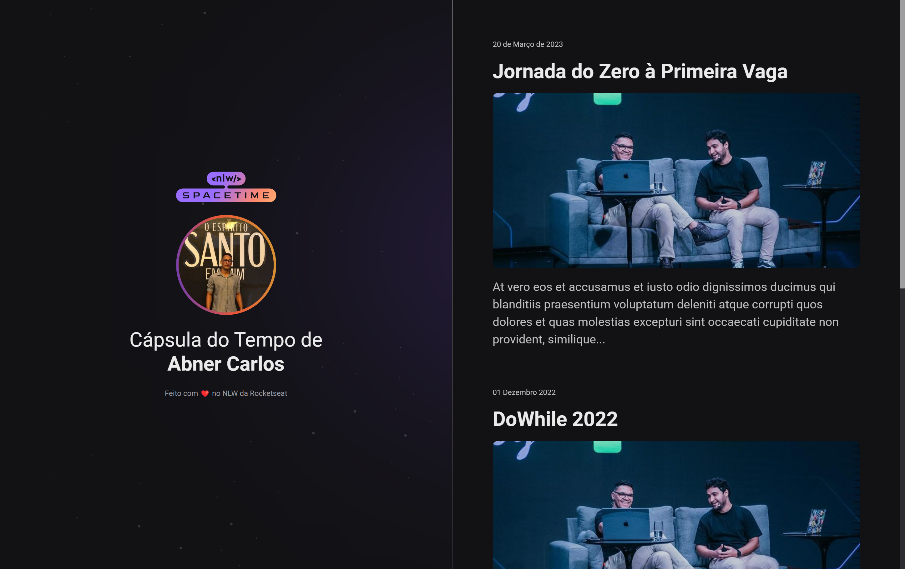

  

## 💻 Projeto

Esse projeto é um projeto web responsivo de uma cápsula do tempo para exibir memórias em uma linha do tempo.

## 🚀 Tecnologias

Esse projeto foi desenvolvio durante a NLW da Rocketseat com as seguintes tecnologias:

- HTML
- CSS
- GIT e GITHUB

## 🏷️ Layout

Você pode visualizar o layout do projeto através
[desse link] (https://abnerkbs.github.io/nlw-spacetime/)
